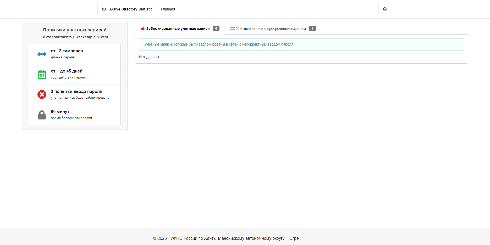

# ADUserStatistics

## Описание
Показывает информацию о заблокированных учетных записях и учетных записях с истекшим сроком смены пароля.

### Изображение

## Требования
- Настроить IIS
- Установить Net Framework
- Установить Asp.Net Core Runtime

## Настройки
> ### Файл appsettings.json
> ---
> ``LdapPath`` - путь каталога Active Directory (например, `LDAP://OU=departments,DC=example,DC=ru`) \
> &nbsp;